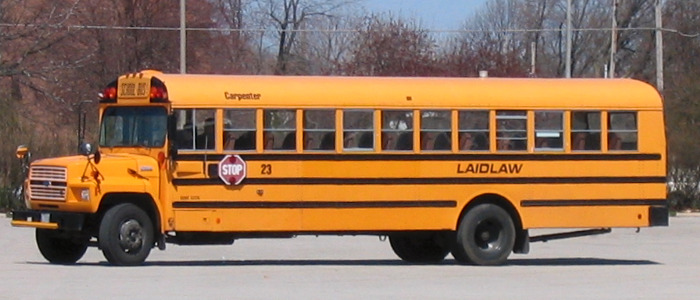
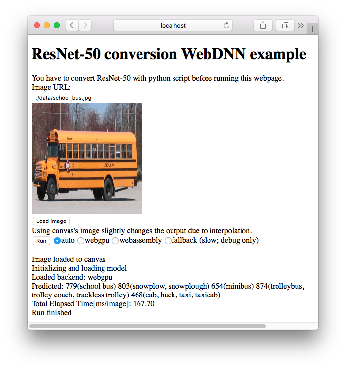

# Use with keras model

```eval_rst
In this tutorial, we'll convert ResNet50 [#f1]_ classification model 
pretrained in Keras [#f2]_ into WebDNN execution format.
```

1. Export Keras pretrained model

    ```python
    from keras.applications import resnet50
    model = resnet50.ResNet50(include_top=True, weights='imagenet')
    model.save("resnet50.h5")
    ```

2. Convert Keras model to our computation graph format

    ```sh
    python bin/convert_keras.py resnet50.h5 --input_shape '(1,224,224,3)' --out output
    ```

    At least you need to specify the model file and the shape of input array.

    Now you have the "graph descriptor" to execute on the web browsers in output directory.

3. Run on web browser

    This document illustrates the essence of running the "graph descriptor" to execute on the web browsers.
    In `convert_keras` example directory, the complete codes for training and converting a Keras model and running it on the web browsers can be found.

    First, You have to initialize [`DescriptorRunner`](../api_reference/descriptor_runner/interfaces/webdnn.dnndescriptorrunner.html) 
    and load model data.

    ```js
    let runner = await WebDNN.load('./output');
    ```

    WebDNN automatically select the best backend based on Browser type and 
    compiled model data on the server.

    You can check the backend type

    ```js
    console.log(runner.backendName);
    ```

    

    Then you can get input and output variable references (`SymbolicFloat32Array` type).

    ```js
    let x = runner.getInputViews()[0];
    let y = runner.getOutputViews()[0];
    ```

    That's all for initialization. You only have to do this at once in the application.

    Let's classify this image.

    

    First, set input data.

    ```js
    x.set(await WebDNN.Image.getImageArray('/example/data/school_bus.jpg', { dstW: 224, dstH: 224 }));
    ```
    
    ``

    Next, run model.

    ```js
    await runner.run();
    ```

    That's all.

    Show computed vector and predicted label.

    ```js
    let y_typed_array = y.toActual();
    console.log('Computed vector', y_typed_array);
    console.log('Predicted Label', WebDNN.Math.argmax(y_typed_array));
    ```

    

    Congratulation! `LabelID:779` is `"School bus"` in ImageNet. It looks work well.

```eval_rst
.. rubric:: References
.. [#f1] K. He, X. Zhang, S. Ren, and J. Sun, "Deep Residual Learning for Image Recognition", IEEE Conference on Computer Vision and Pattern Recognition (CVPR), 2016.
.. [#f2] https://keras.io/applications/#resnet50
```
